# Project 1: On-Premises & Hybrid Cloud Infrastructure

## Project Overview

This foundational project simulates the design and deployment of a complete on-premises and hybrid cloud infrastructure for a small business, "Contoso Ltd." The project began with building a core on-premises network using Windows Server, including identity, network services, and centralized management. It concluded by integrating this traditional environment with the cloud using Microsoft Entra ID and implementing modern endpoint management for both Windows and Android devices with Microsoft Intune.

## Technologies Used

*   Windows Server 2022
*   Active Directory Domain Services (AD DS)
*   **DNS, DHCP, and Group Policy (GPO)**
*   **Routing and Remote Access (RRAS) for NAT**
*   **Microsoft Intune (Endpoint Manager)**
*   Microsoft Entra ID
*   Microsoft Entra ID Connect v2
*   PowerShell 5.1

---
## 1. Core On-Premises Infrastructure & Management

The first phase was to build a fully functional local area network from the ground up using Hyper-V.

### Active Directory & DNS

I deployed a domain controller (`DC01`) for the `corp.contoso.com` domain, which also serves as the authoritative DNS server for the internal network. I demonstrated DNS management by creating a manual A (Host) record for a fictional server.

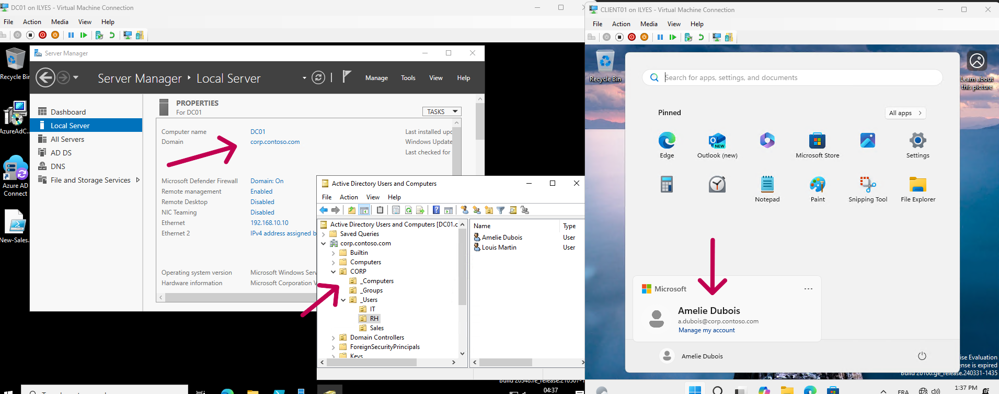
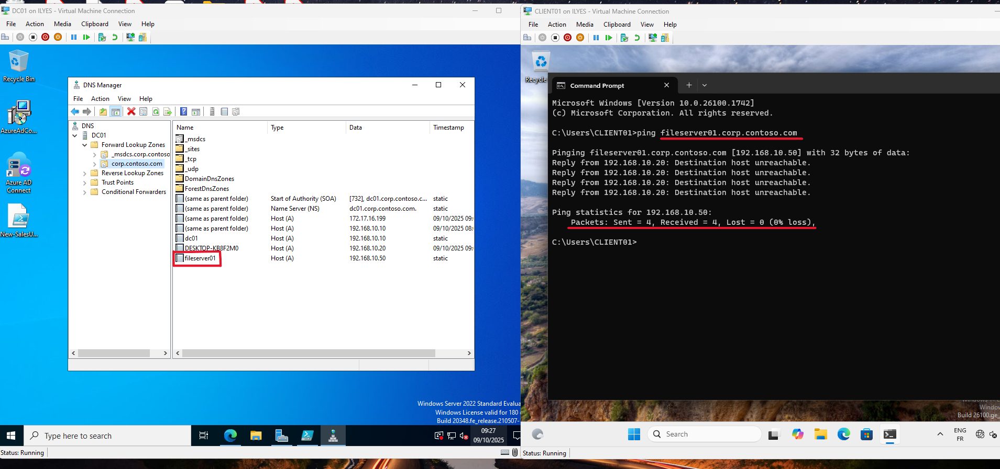

### DHCP Server & Network Routing

To provide automatic IP configuration for clients, I installed and configured the DHCP role on `DC01`. This included creating a scope, setting an IP address range, and configuring options for the default gateway and DNS server. To provide secure internet access to the lab, I also configured the Routing and Remote Access Service (RRAS) to function as a NAT router.

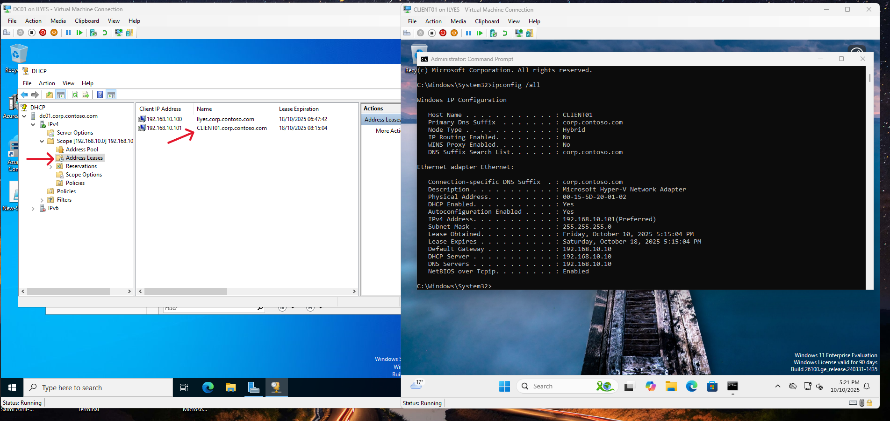

### Centralized Management with Group Policy (GPO)

To demonstrate centralized client management, I used Group Policy to automatically map a network drive for users in the "Sales" department. This involved configuring a file share, creating a new GPO, and linking it to the correct OU. I successfully troubleshooted a path typo to ensure the policy was applied correctly on the client machine.

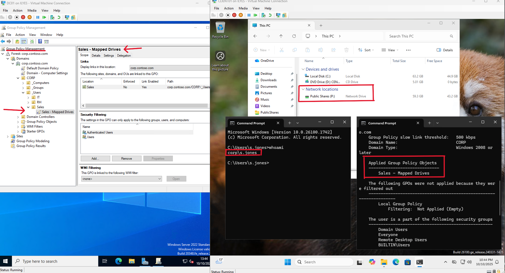

---
## 2. Hybrid Identity Configuration

The second phase was to connect the established on-premises environment to the cloud.

### Custom Domain Verification

A critical prerequisite was to verify the on-premises domain namespace (`corp.contoso.com`) within Microsoft Entra ID to establish trust and ensure correct user principal name (UPN) mapping.

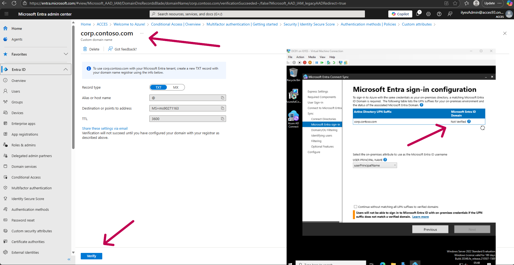

### User Synchronization to the Cloud

Using Microsoft Entra ID Connect, I configured the synchronization bridge. Key configurations included Password Hash Synchronization (PHS) and OU Filtering to ensure only designated user accounts were synced.

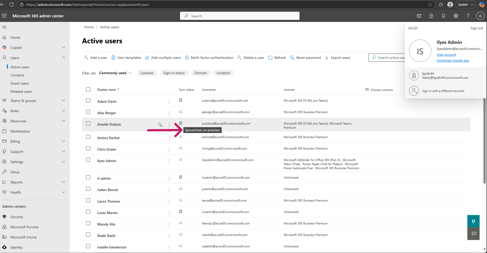

### End-to-End User Authentication Test

The ultimate test was to log in as a synced user (`Amelie Dubois`) to the Office 365 portal using her on-premises credentials, which validated the entire identity flow.

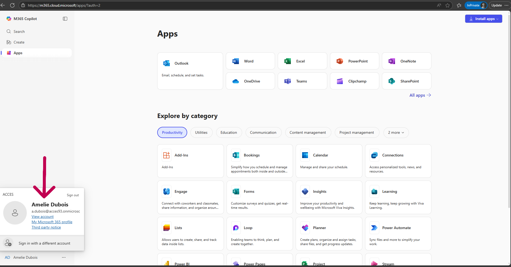

---
## 3. Automation and Technical Detail

### Automation of User Onboarding

To demonstrate efficiency, I wrote a PowerShell script to automate the creation of new user accounts in Active Directory. This script creates a user in the correct OU and initiates a sync cycle with Entra ID Connect.

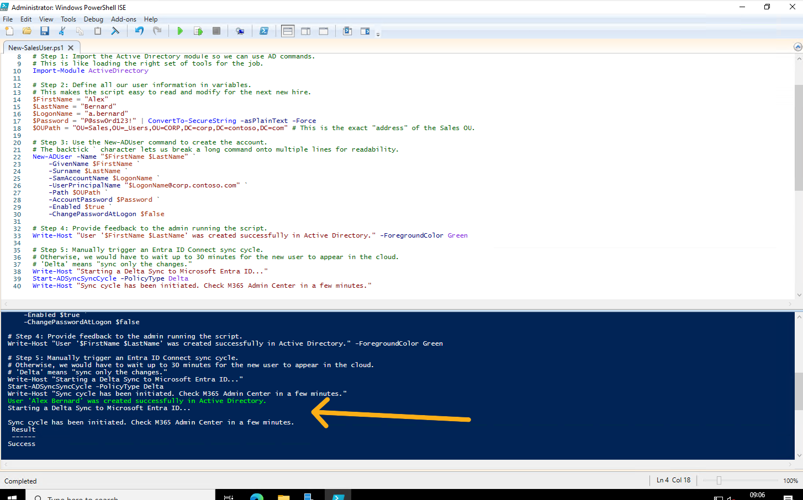

*(The full script is available in the repository.)*

### Evidence of Technical Detail (Source Anchor)

To confirm the identity link, I inspected the user object's attributes in Active Directory. The presence of a value in the `msDS-ConsistencyGuid` attribute serves as the immutable "source anchor" linking the on-prem object to its cloud counterpart.

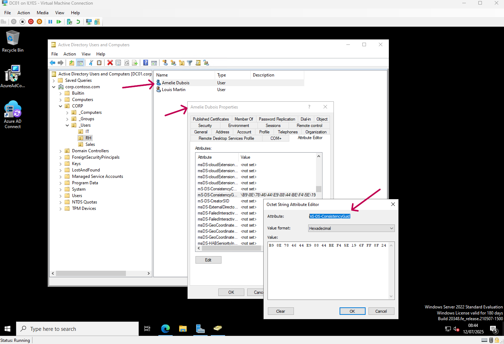

---
## 4. Modern Endpoint Management with Microsoft Intune

The final phase of the project was to bridge the gap between traditional and modern management by implementing Microsoft Intune for both corporate and personal devices.

### A) Co-managing Corporate Windows Devices

The goal was to enroll the on-premises, domain-joined `CLIENT01` into Intune to create a "co-managed" state. I configured Hybrid Entra Join, enabled automatic MDM enrollment in Intune, and created a GPO to enforce enrollment. The `dsregcmd /status` command confirmed the device was successfully Hybrid Joined.

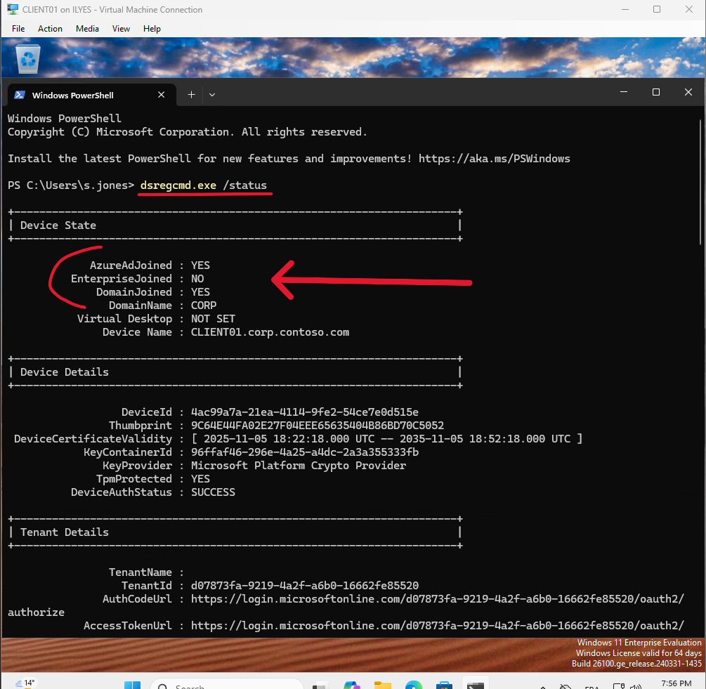
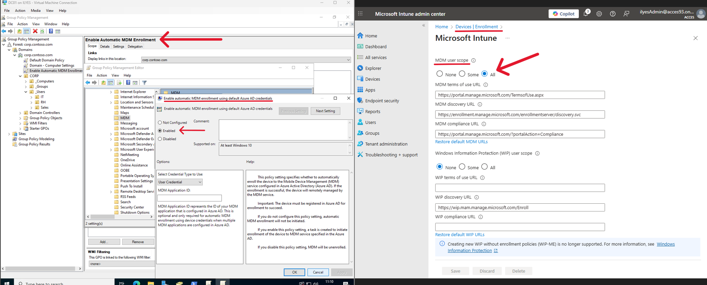

#### Advanced Troubleshooting & Root Cause Analysis
Despite a successful Hybrid Join, the device failed to enroll in Intune. I began a systematic troubleshooting process:
1.  Investigated the client's Event Viewer logs, which revealed an "MDM not configured" error.
2.  Verified the user's Intune license and checked the Enrollment Platform Restrictions, which were all correct.
3.  Used the CNAME Validation tool in the Intune portal for a deeper diagnosis.

This final step revealed the root cause: **the tenant's default DNS CNAME records for Intune enrollment were missing.** This tenant-level provisioning issue was preventing the device from discovering the enrollment service. This diagnostic process demonstrates a systematic approach to resolving complex, multi-layered technical issues.

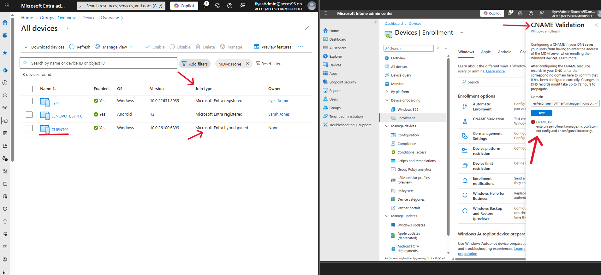

### B) Securing Personal (BYOD) Android Devices

To demonstrate Bring-Your-Own-Device management, I successfully enrolled a personal Android phone, proving the Intune service was configured correctly.

*   **Enrollment & Work Profile:** I configured Intune to allow personally owned Android Enterprise devices. The enrollment on the phone successfully created a **Work Profile**, which securely isolates all corporate data and managed applications inside an encrypted container.

*   **Application Deployment:** I used Intune to approve Microsoft Teams, Viva and SharePoint in the Managed Google Play store and then assigned them as "Required" apps to my user group. These apps were automatically pushed to the device and installed directly into the secure Work Profile.

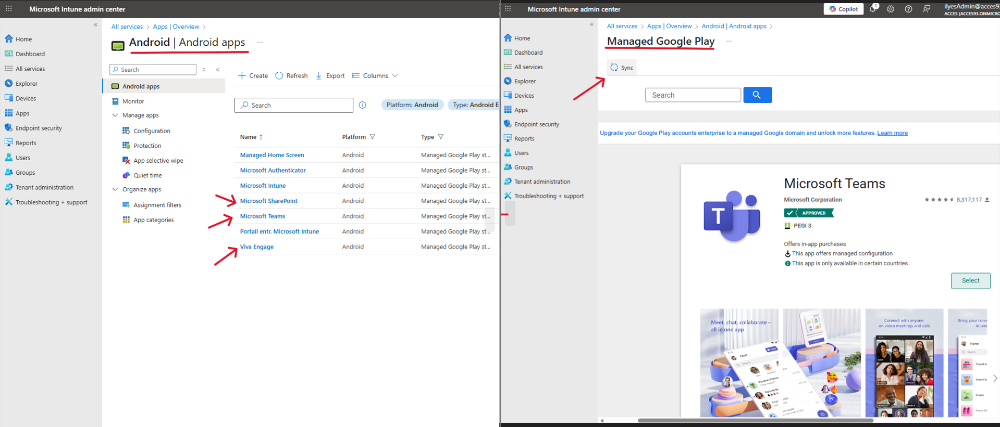
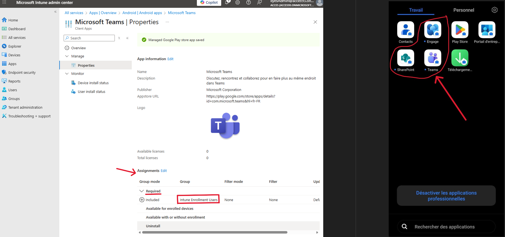

---
## Summary of Skills Demonstrated

*   **Full-Stack Infrastructure:** Deployed and managed a complete on-premises and hybrid infrastructure, including AD, DNS, DHCP, GPO, and RRAS (NAT).
*   **Modern Endpoint Management (MDM):** Configured and managed Microsoft Intune for both corporate (co-managed Windows) and personal (BYOD Android) devices.
*   **Advanced Troubleshooting:** Demonstrated a systematic approach to diagnosing a complex Intune enrollment failure, using client logs and tenant-level diagnostics to identify a root cause related to DNS CNAME records.
*   **Centralized & Cloud Policy Management:** Utilized both traditional Group Policy and modern Intune policies to manage devices.
*   **Hybrid Cloud Integration:** Configured Microsoft Entra ID Connect to synchronize user and device identities to the cloud.
*   **BYOD & Security:** Implemented a secure solution for personal devices using the Android Enterprise Work Profile and deployed managed applications from the cloud.
*   **IT Automation:** Scripted user management tasks using PowerShell to improve efficiency and reduce manual error.
