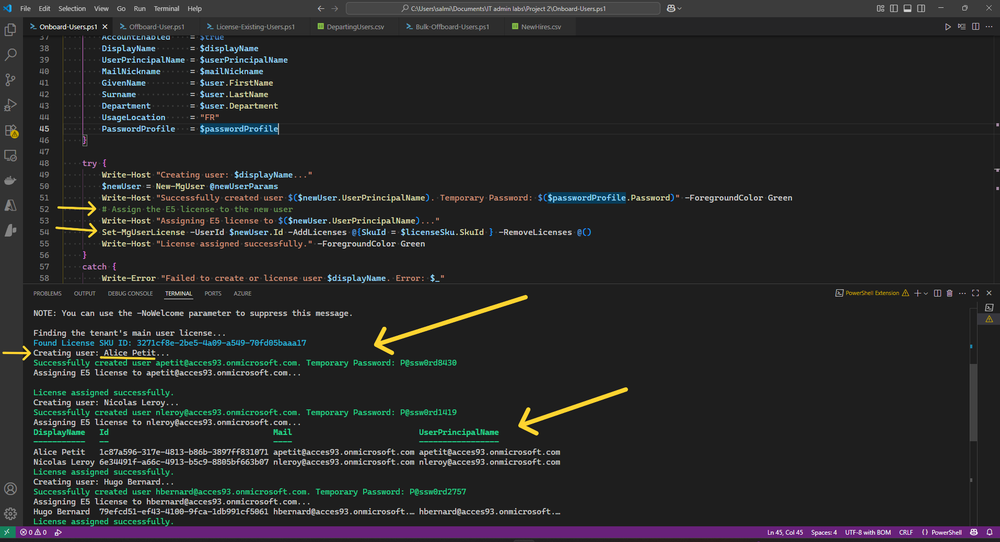
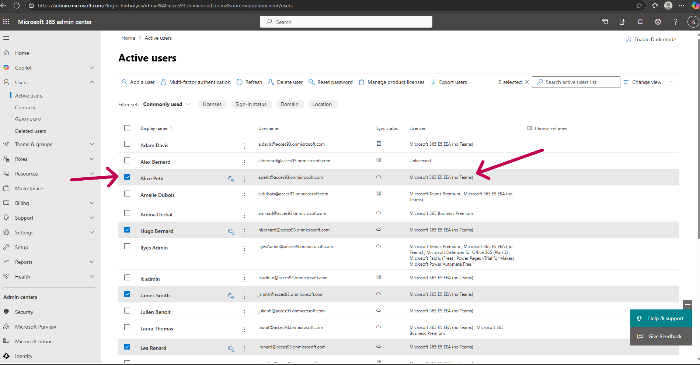
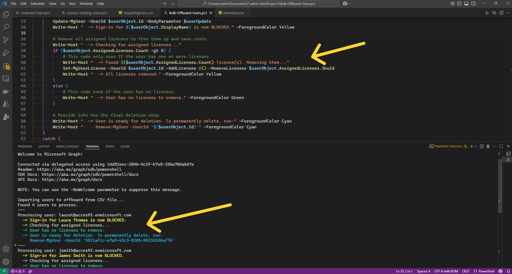

# Project 2: Cloud-Native User Automation with Microsoft Graph API

## Project Overview

This project simulates the complete lifecycle management of cloud-native users for a growing company. The primary goal was to automate the onboarding and offboarding processes using modern tools, ensuring efficiency, security, and scalability. All operations were performed using the **Microsoft Graph PowerShell SDK**, which is the current industry standard, replacing legacy modules like MSOnline.

## Technologies Used

*   PowerShell 7
*   **Microsoft Graph PowerShell SDK**
*   Microsoft Entra ID
*   Microsoft 365 E5 Licensing
*   Visual Studio Code

## 1. Automated Onboarding from a CSV File

I developed a PowerShell script (`Onboard-CloudUsers.ps1`) to ingest a list of new hires from a CSV file. The script performs the following actions for each user:
*   Connects to Microsoft Graph with the required `User.ReadWrite.All` permissions.
*   Programmatically finds the correct License SKU ID for the tenant's primary license.
*   Creates a new user account in Microsoft Entra ID with properties from the CSV.
*   Sets the user's mandatory "Usage Location" to enable license assignment.
*   Assigns a secure, temporary password and sets the "Force password change on next sign-in" flag—a critical security best practice.
*   Assigns the correct license to the new user.

The script's output provides a real-time audit trail of created users and their temporary passwords.

```PowerShell
# # This script onboards new cloud-only M365 users from a CSV file using Microsoft Graph API.

# Connect to Microsoft Graph with the necessary permissions.
Write-Host "Connecting to Microsoft Graph ..."
Connect-MgGraph -Scopes "User.ReadWrite.All", "Directory.ReadWrite.All"

# Find the main assignable license in this tenant.
Write-Host "Finding the tenant's main user license..."
$licenseSku = Get-MgSubscribedSku | Where-Object { $_.SkuPartNumber -eq "O365_w/o_Teams_Bundle_M5" }

# A safety check. If we didn't find the license, we stop the script.
if (-not $licenseSku) {
    Write-Error "Could not find the specified license SKU (O365_w/o_Teams_Bundle_M5) in this tenant."
    return
}
Write-Host "Found License SKU ID: $($licenseSku.SkuId)" -ForegroundColor Cyan

# Import the user data from the CSV file.
$users = Import-Csv -Path "C:\Temp\NewHires.csv"

# Loop through each user in the CSV and create their account.
foreach ($user in $users) {
    # Construct the user's information
    $displayName = "$($user.FirstName) $($user.LastName)"
    $mailNickname = "$($user.FirstName.Substring(0,1))$($user.LastName)".ToLower()
    $userPrincipalName = "$($mailNickname)@acces93.onmicrosoft.com"

    # Define the user's password profile and forces the user to change their password on first login.
    $passwordProfile = @{
        ForceChangePasswordNextSignIn = $true
        Password                      = ('P@ssw0rd' + (Get-Random -Minimum 1000 -Maximum 9999)) # Generate a temporary, random password
    }

    # Create the user object with all properties
    $newUserParams = @{
        AccountEnabled    = $true
        DisplayName       = $displayName
        UserPrincipalName = $userPrincipalName
        MailNickname      = $mailNickname
        GivenName         = $user.FirstName
        Surname           = $user.LastName
        Department        = $user.Department
        UsageLocation     = "FR"
        PasswordProfile   = $passwordProfile
    }

    try {
        Write-Host "Creating user: $displayName..."
        $newUser = New-MgUser @newUserParams
        Write-Host "Successfully created user $($newUser.UserPrincipalName). Temporary Password: $($passwordProfile.Password)" -ForegroundColor Green

        # Assign the E5 license to the new user
        Write-Host "Assigning E5 license to $($newUser.UserPrincipalName)..."
        Set-MgUserLicense -UserId $newUser.Id -AddLicenses @{SkuId = $licenseSku.SkuId } -RemoveLicenses @()
        Write-Host "License assigned successfully." -ForegroundColor Green
    }
    catch {
        Write-Error "Failed to create or license user $displayName. Error: $_"
    }
}
```



The newly created users were immediately visible and correctly configured in the Microsoft 365 Admin Center, fully licensed and ready for work.



## 2. Scalable and Secure Bulk Offboarding

To handle departing employees, a second script (`Bulk-Offboard-Users.ps1`) was developed to process a list of users from a CSV file. This script follows a secure offboarding workflow:
1.  **Immediate Sign-in Block:** The user's account is immediately disabled to prevent any further access.
2.  **License Reclamation:** The script first checks if the user has licenses, then removes all assigned licenses to free them up for new employees and ensure cost efficiency.
3.  **Robust Error Handling:** The entire process for each user is wrapped in a `try/catch` block, allowing the script to report an error for one user (e.g., a typo in the CSV) and continue processing the rest of the list.

```PowerShell
This script securely offboards multiple cloud-only users from a CSV file.

# Connect to Microsoft Graph with the necessary permissions.
Write-Host "Connecting to Microsoft Graph..."
Connect-MgGraph -Scopes "User.ReadWrite.All", "Directory.ReadWrite.All"

# Import the list of departing employees.
Write-Host "Importing users to offboard from CSV file..."
$usersToOffboard = Import-Csv -Path "C:\Temp\DepartingUsers.csv"
Write-Host "Found $($usersToOffboard.Count) users to process."
Write-Host "---"

# Loop through each user in the CSV and perform the secure offboarding process.
foreach ($user in $usersToOffboard) {

    # This is the UPN from our CSV file for the current user in the loop.
    $upn = $user.UserPrincipalName

    # This is the error handling block. PowerShell will TRY to run the code inside {}.
    # If ANY command fails, it will immediately jump to the CATCH block.
    try {
        # Find the user in Microsoft Entra ID.
        Write-Host "Processing user: $upn"
        $userObject = Get-MgUser -UserId $upn -ErrorAction Stop

        # Block their sign-in immediately using the correct BodyParameter format.
        # Create a "body" package (a hashtable) containing the properties we want to change.
        $userUpdate = @{
            AccountEnabled = $false
        }
        # Now we call Update-MgUser and pass the entire package to the -BodyParameter.
        Update-MgUser -UserId $userObject.Id -BodyParameter $userUpdate
        Write-Host "  -> Sign-in for $($userObject.DisplayName) is now BLOCKED." -ForegroundColor Yellow

        # Remove all assigned licenses to free them up and save costs.
        Write-Host "  -> Checking for assigned licenses..."
        if ($userObject.AssignedLicenses.Count -gt 0) {
            # This code only runs IF the user has one or more licenses.
            Write-Host "  -> Found $($userObject.AssignedLicenses.Count) license(s). Removing them..."
            Set-MgUserLicense -UserId $userObject.Id -AddLicenses @() -RemoveLicenses $userObject.AssignedLicenses.SkuId
            Write-Host "  -> All licenses removed." -ForegroundColor Yellow
        }
        else {
            # This code runs if the user has no licenses.
            Write-Host "  -> User has no licenses to remove." -ForegroundColor Green
        }

        # Provide info for the final deletion step.
        Write-Host "  -> User is ready for deletion. To permanently delete, run:" -ForegroundColor Cyan
        Write-Host "     Remove-MgUser -UserId '$($userObject.Id)'" -ForegroundColor Cyan
    }
    catch {
        # This code only runs if something in the 'try' block failed.
        # The "$_" variable automatically contains the error message.
        Write-Error "Failed to process user '$upn'. They might not exist or another error occurred. Details: $_"
    }
    Write-Host "---"
}
```


## 3. Real-World Troubleshooting

During development, several real-world challenges were encountered and resolved:
*   **Incorrect License SKU:** The initial script failed because the hardcoded license SKU (`SPE_E5`) did not match the tenant's actual SKU. This was resolved by using `Get-MgSubscribedSku` to dynamically find the correct license part number.
*   **Missing PowerShell Modules:** The `Set-MgUserLicense` command failed because its specific module (`Microsoft.Graph.Users.Actions`) was not installed. This was resolved by identifying and installing the required module.
*   **Invalid Usage Location:** License assignments failed with a "BadRequest" error. I diagnosed this as a missing "Usage Location" property on the user accounts and updated the scripts to set this mandatory property before attempting to assign a license.
*   **Modern Graph SDK Syntax:** An error with the `Update-MgUser` command was traced to a syntax change in the modern SDK. The issue was resolved by using the correct `-BodyParameter` format to pass the account status.

---
## Summary of Skills Demonstrated

*   **Modern IT Automation:** Utilized the current-generation **Microsoft Graph PowerShell SDK** to perform complex administrative tasks, demonstrating modern, best-practice scripting skills.
*   **Identity Lifecycle Management:** Managed the full user lifecycle from creation and licensing to secure offboarding and license reclamation.
*   **Advanced Troubleshooting:** Successfully diagnosed and resolved multiple real-world errors related to licensing, module dependencies, and mandatory user attributes.
*   **Robust Scripting:** Implemented security best practices (force password change on next sign-in) and robust features like error handling (`try/catch`) and pre-checks (verifying if a user has licenses before removal).
*   **Process Efficiency:** Created a scalable solution that can manage dozens of users in seconds, a massive improvement over manual GUI-based methods.
