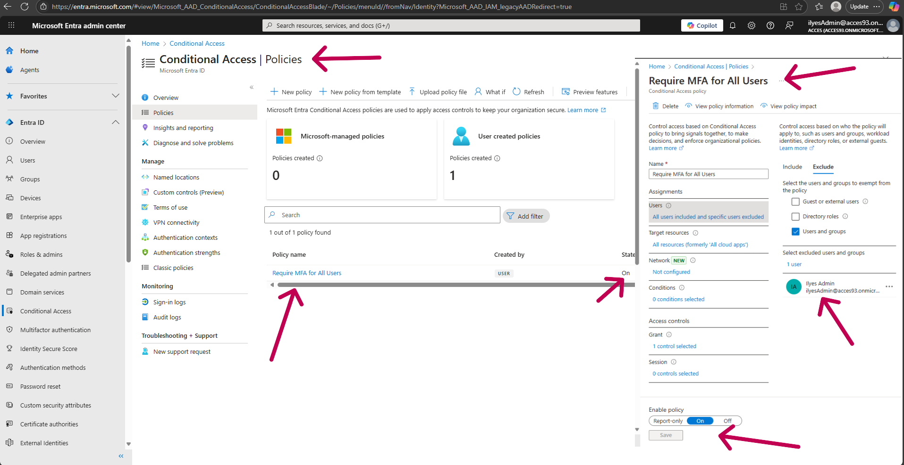
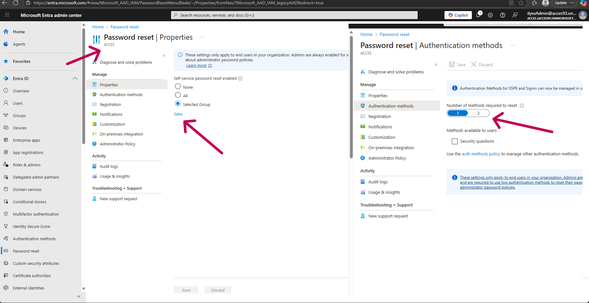
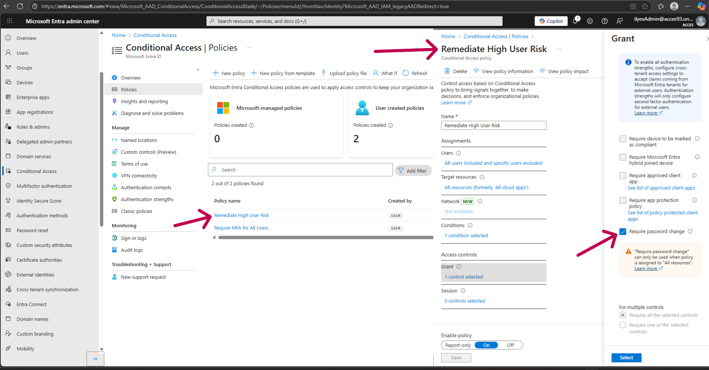
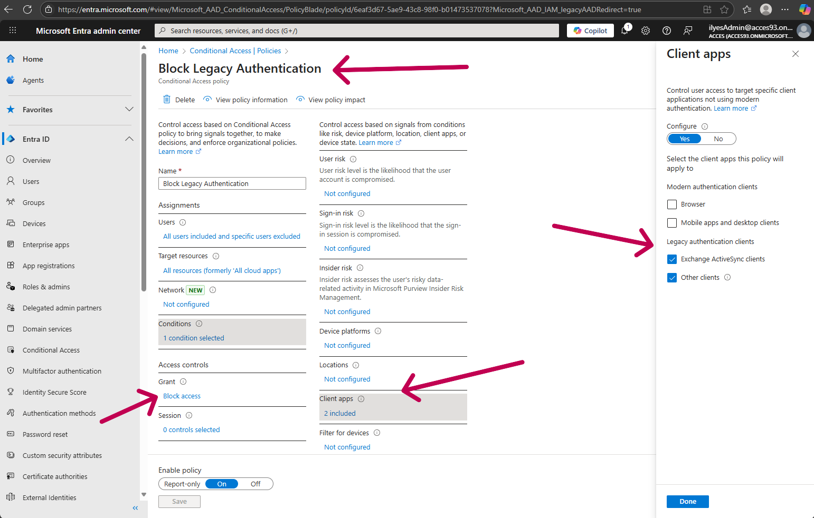
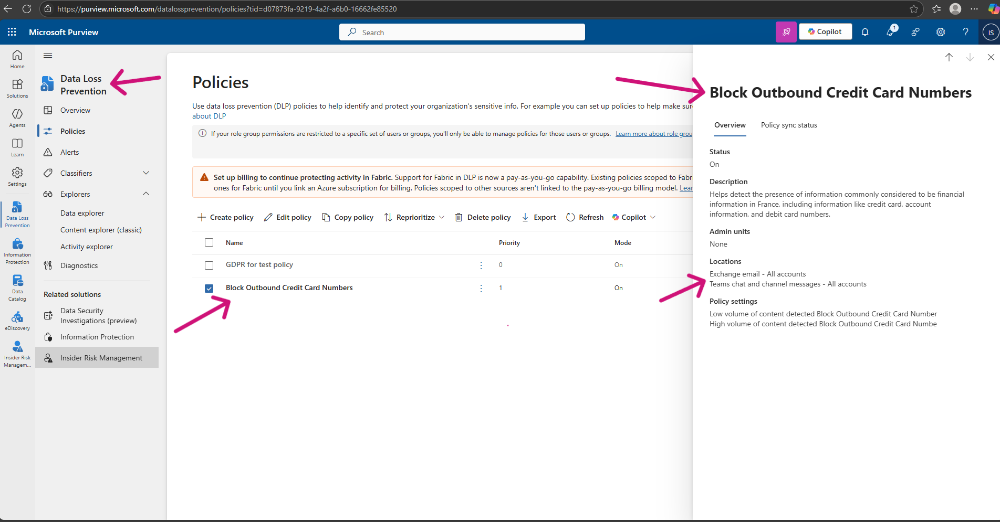
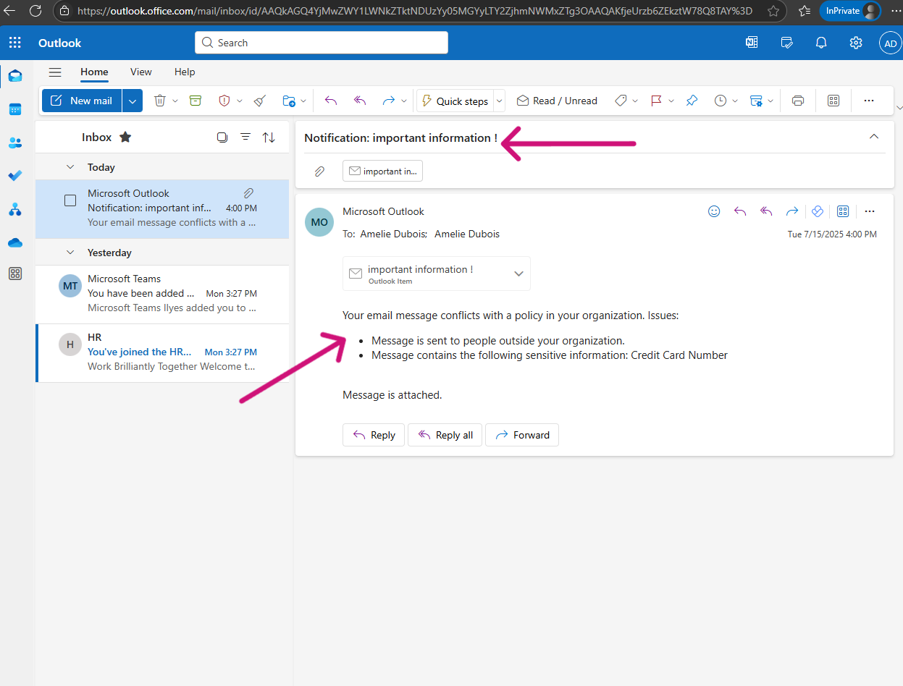
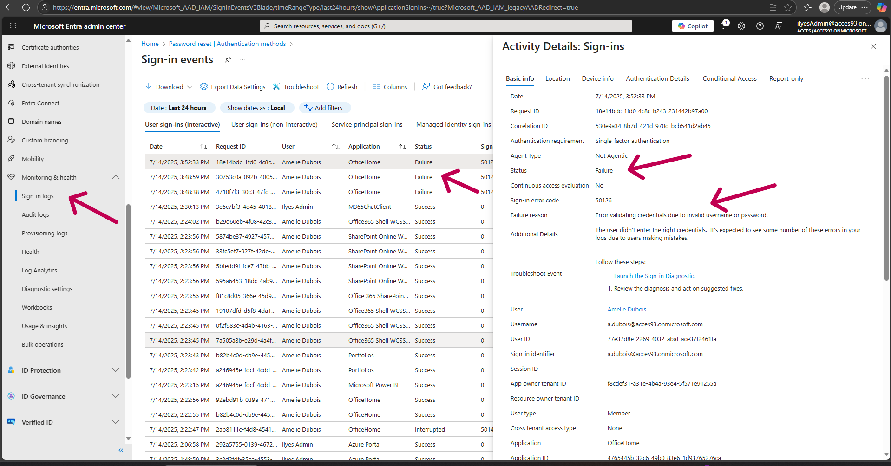

# Project 2: M365 Security & Compliance Baseline

## Project Overview

Following the successful implementation of a hybrid identity system, this project addresses a common business need: securing the Microsoft 365 tenant against modern threats. The objective was to implement a layered security approach to protect user identities, sign-ins, and sensitive data, moving beyond basic password protection to a robust, intelligent security posture.

## Technologies Used

*   Microsoft Entra ID (P2 Features)
*   Conditional Access
*   Identity Protection
*   Microsoft Purview (for Data Loss Prevention)
*   Microsoft 365 E5 Licensing

## Implementation Steps

### 1. Foundational Identity Protection

The first layer of defense focused on strengthening user identity and access.

*   **Multi-Factor Authentication (MFA):** I created a Conditional Access policy (`CA01`) to enforce MFA for all users (excluding a break-glass admin account). This ensures that a compromised password alone is not enough to grant access.

*   **Self-Service Password Reset (SSPR):** To empower users and reduce helpdesk load, I enabled SSPR. This allows users to securely reset their own passwords after verifying their identity with a pre-registered method, like the Microsoft Authenticator app.

### 2. Advanced Threat Protection & Automated Response

The next layer involved creating automated policies to respond to specific threats.

*   **User Risk Remediation:** I configured a Conditional Access policy (`CA02`) to protect against compromised accounts. This policy uses Identity Protection intelligence to detect high-risk users and automatically forces them to perform a secure password change, mitigating the threat without manual IT intervention.

*   **Blocking Legacy Authentication:** To close a major security loophole that bypasses MFA, I implemented a policy (`CA03`) to explicitly block legacy authentication protocols like POP, IMAP, and SMTP.

### 3. Data Security & Compliance

The final layer focused on protecting the data itself.

*   **Data Loss Prevention (DLP):** I implemented a basic DLP policy to prevent the accidental or intentional leakage of sensitive financial data. This policy inspects outgoing emails and Teams messages for content matching credit card number patterns and automatically blocks them from being sent to external recipients. The effectiveness was tested by attempting to email a mock credit card number, which was successfully blocked by a policy tip.

## Troubleshooting & Analysis

A key part of administration is diagnosing issues. To demonstrate this skill, I analyzed a failed sign-in attempt using the Entra ID Sign-in logs. The logs provided clear, actionable information, including the specific error code and failure reason, allowing for quick and accurate troubleshooting.

---
## Summary of Skills Demonstrated

This project showcases a multi-layered approach to security, demonstrating skills across identity, threat protection, and data governance:

*   **Conditional Access & Zero Trust:** Designed and implemented multiple Conditional Access policies, which are the foundation of a modern Zero Trust security model.
*   **Identity Security & MFA:** Enforced Multi-Factor Authentication across the tenant to protect against password-based attacks and configured Self-Service Password Reset (SSPR) to empower users.
*   **Automated Threat Response:** Configured Identity Protection policies to automatically remediate user risk by forcing a secure password change in response to high-risk events.
*   **Security Hardening:** Eliminated a major attack vector by creating a policy to explicitly block legacy authentication protocols that bypass modern security controls.
*   **Data Loss Prevention (DLP):** Implemented and tested a Microsoft Purview DLP policy to detect and prevent the exfiltration of sensitive financial data via email and Teams.
*   **Security Monitoring & Troubleshooting:** Utilized Entra ID sign-in logs to diagnose and investigate authentication failures, a core skill for any support or administration role.
