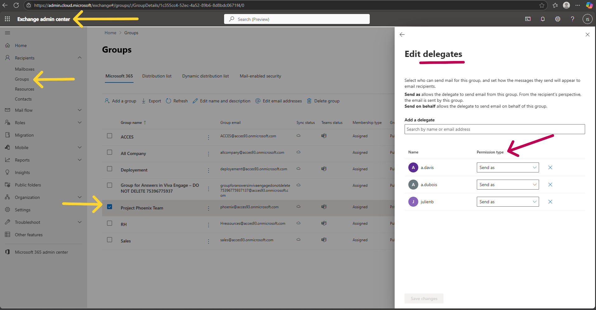
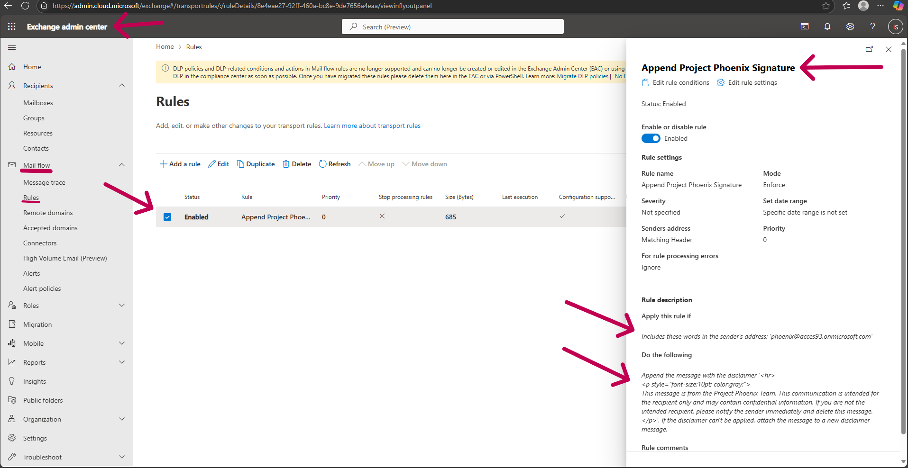
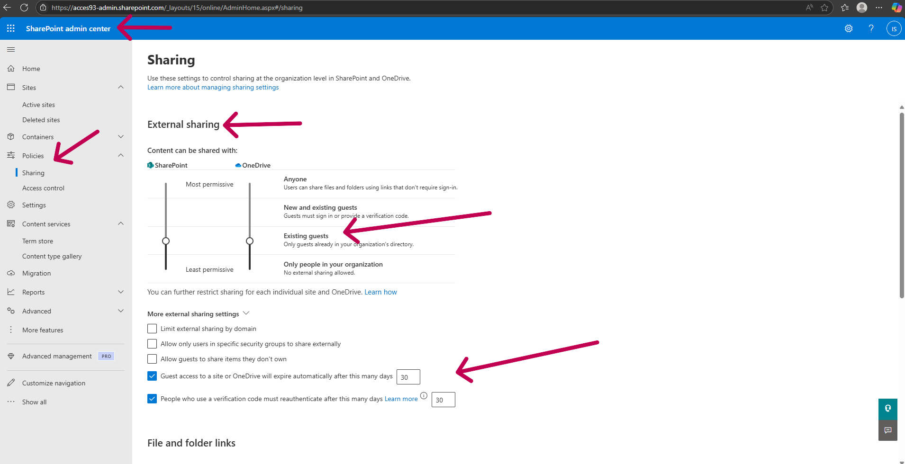
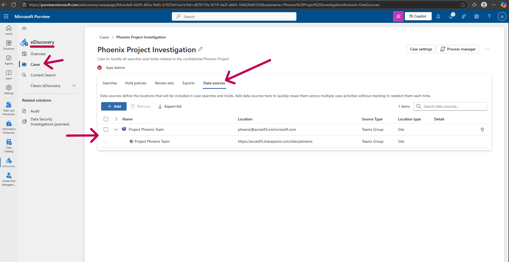
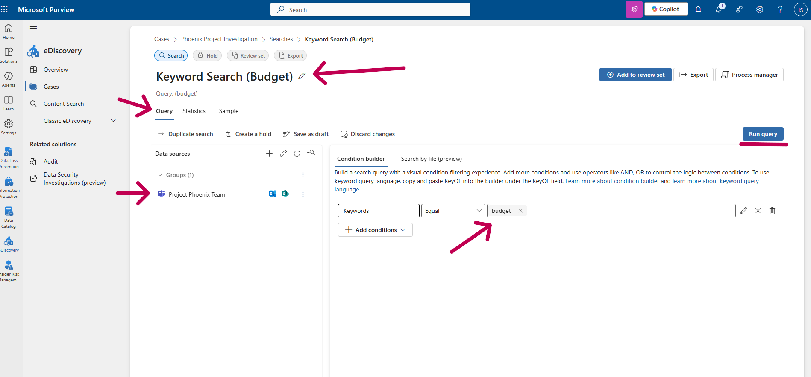
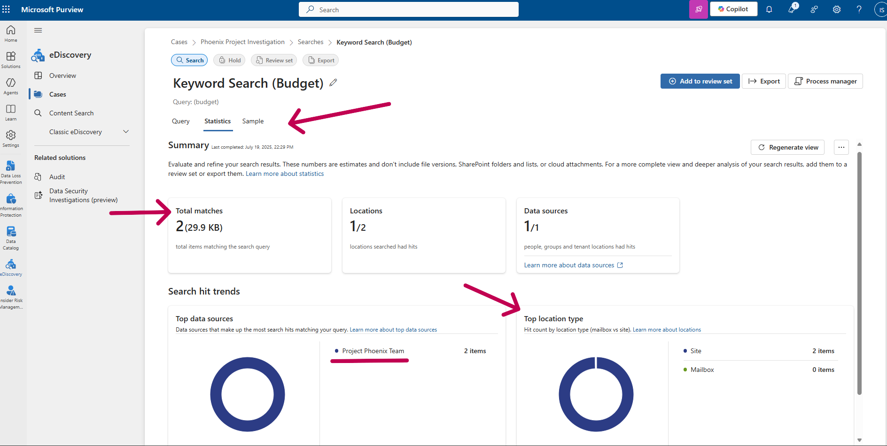

# Project 4: Configuring a Secure Collaboration Environment

## Project Overview

This project simulates a common business request: creating a dedicated and secure digital workspace for a confidential internal project, codenamed "Project Phoenix." The goal was to configure Microsoft Teams and Exchange Online to support the team's collaboration and communication needs while adhering to specific security and compliance requirements. This project involved navigating multiple M365 admin centers to deliver a complete solution.

## Technologies Used

*   Microsoft 365 Admin Center
*   Microsoft Exchange Admin Center (EAC)
*   Microsoft Teams Admin Center
*   Microsoft SharePoint Admin Center
*   Microsoft Purview (eDiscovery)

## Implementation Steps

### 1. Workspace Foundation: The Microsoft 365 Group

The most efficient first step was to create a new, **private Microsoft 365 Group**. This single action provisioned a central user group, a Microsoft Team for collaboration, a shared mailbox with a dedicated email address (`phoenix@...`), and a SharePoint site for file storage.

### 2. Exchange Online Configuration

To meet the professional communication requirements, I configured two key settings in the Exchange Admin Center:

*   **Send As Permissions:** I granted team members "Send As" permissions to the shared group mailbox. This allows them to send emails that appear to come directly from the official `phoenix@...` address, maintaining a professional identity when communicating with external partners.

*   **Mail Flow Rule:** I created a mail flow rule to automatically append a standardized legal disclaimer to all emails sent from the project's shared address. This ensures all external communication meets compliance standards.

### 3. Securing File Collaboration for Guests

The security requirement was to prevent external guests from uploading or sharing files. I diagnosed that this setting has been centralized from the Teams Admin Center to the **SharePoint Admin Center**, which governs all file sharing policies. I configured the organization-wide policy to be more secure by:
*   Setting the master sharing level to **"Existing guests"**, preventing uncontrolled sharing.
*   Enforcing a **30-day expiration policy** on all guest access.
*   Setting the **default link type** to "Only people in your organization" as a safety net.

### 4. Compliance and eDiscovery

To fulfill a simulated legal request, I used the modern **eDiscovery (Standard)** tool in Microsoft Purview. I created a new case to properly contain the investigation, added the Project Phoenix mailbox and SharePoint site as specific data sources, and then ran a keyword search for the term "budget" against those sources.

---
## Summary of Skills Demonstrated

*   **Cross-Platform Administration:** Successfully navigated and configured settings across four different Microsoft 365 admin centers (M365, Exchange, SharePoint, Purview) to deliver a unified solution.
*   **Collaboration & Communication Management:** Configured Microsoft Teams, M365 Groups, and Exchange Online features like shared mailboxes and mail flow rules to meet specific business needs.
*   **Security Policy Management:** Implemented and enforced security policies for guest access and file sharing at the organizational level using the SharePoint Admin Center.
*   **Compliance & eDiscovery:** Utilized the modern, case-based eDiscovery (Standard) tool to perform a targeted content search for legal and compliance purposes.
*   **Adaptability:** Demonstrated the ability to adapt to an evolving cloud environment by troubleshooting and applying correct procedures in newly updated admin interfaces.
