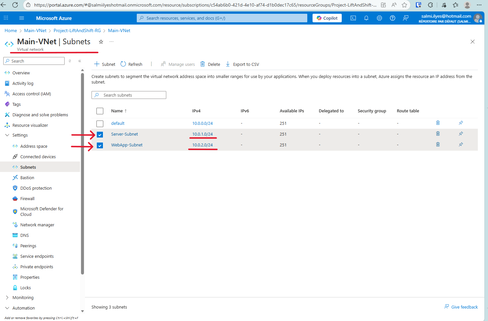
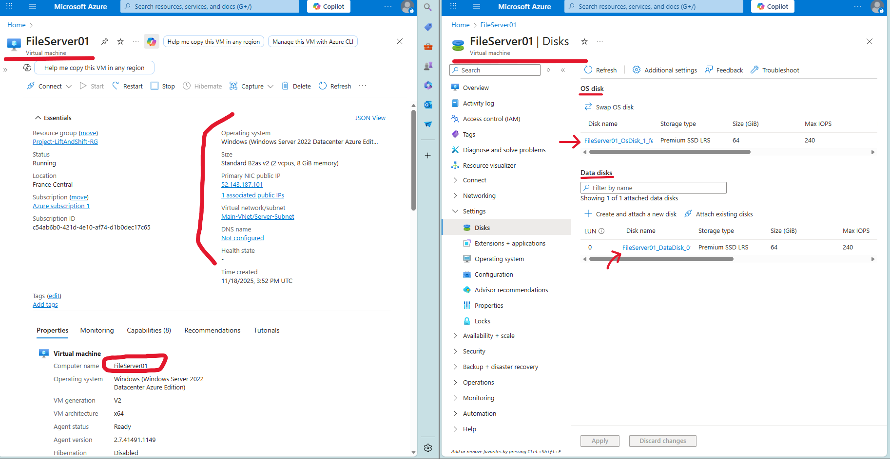
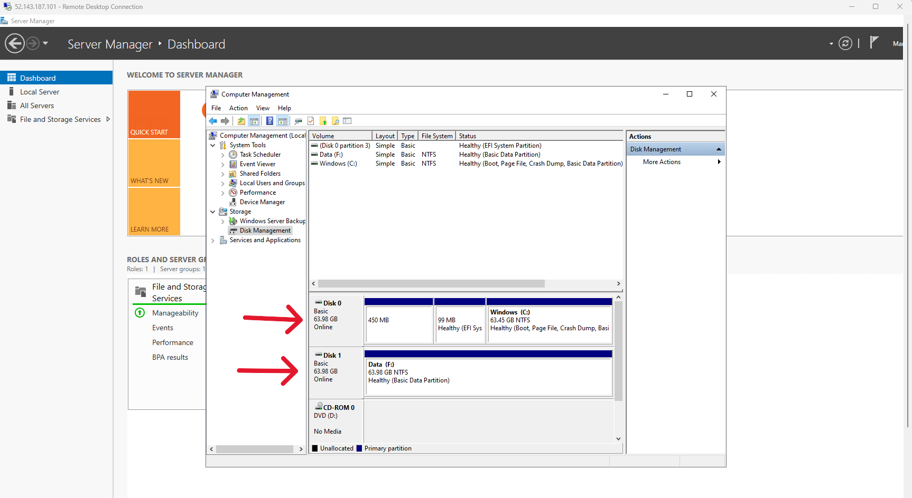
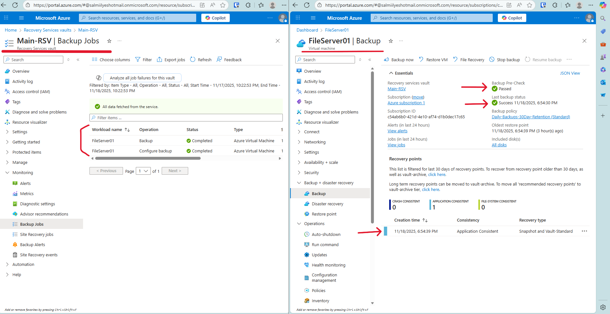
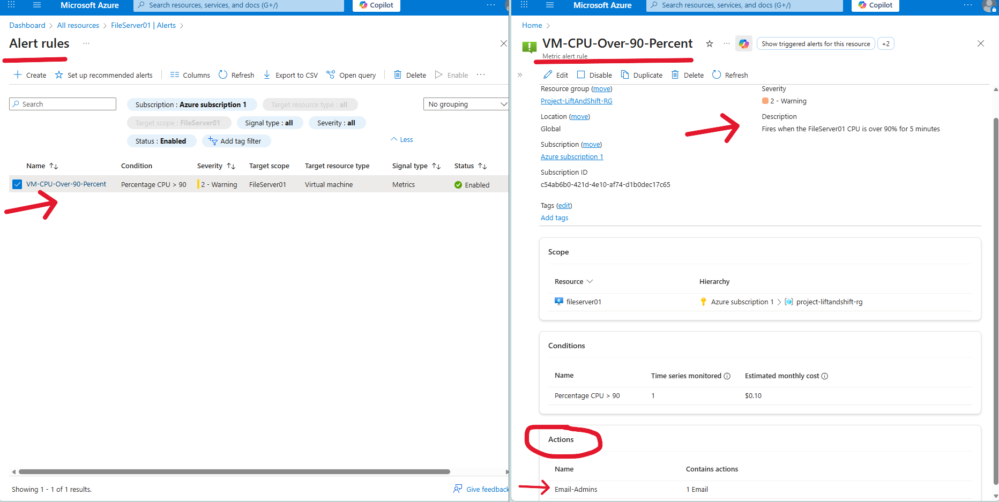
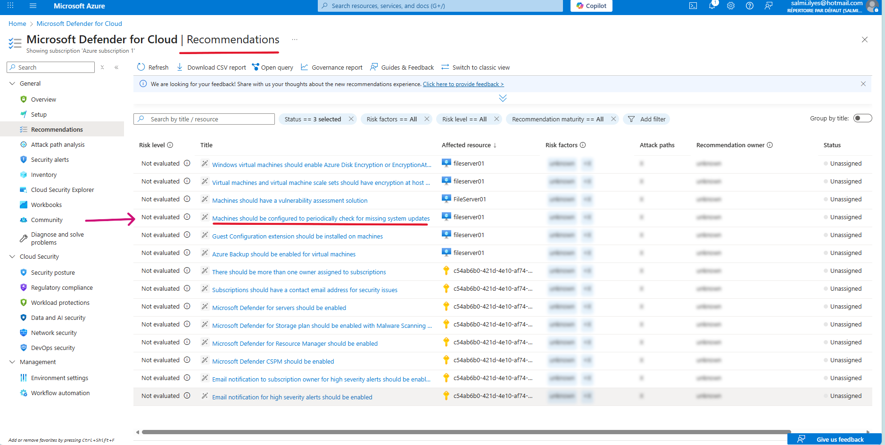
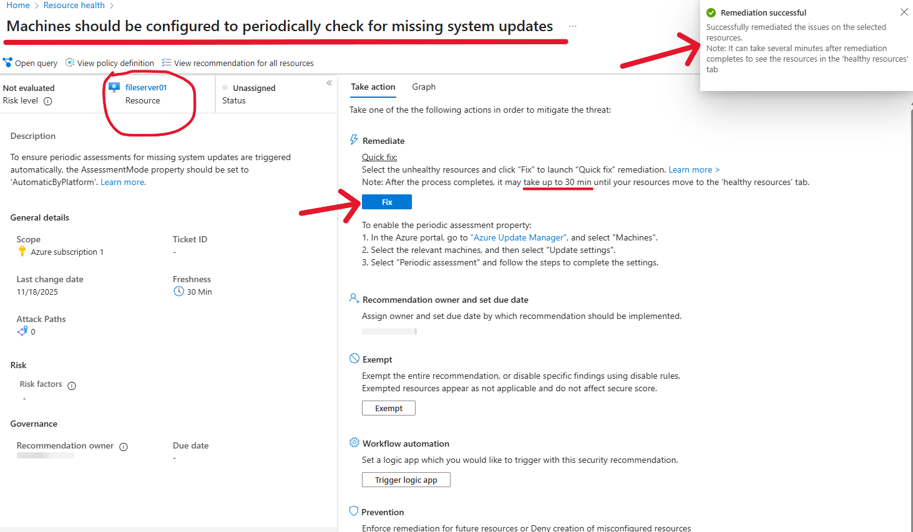
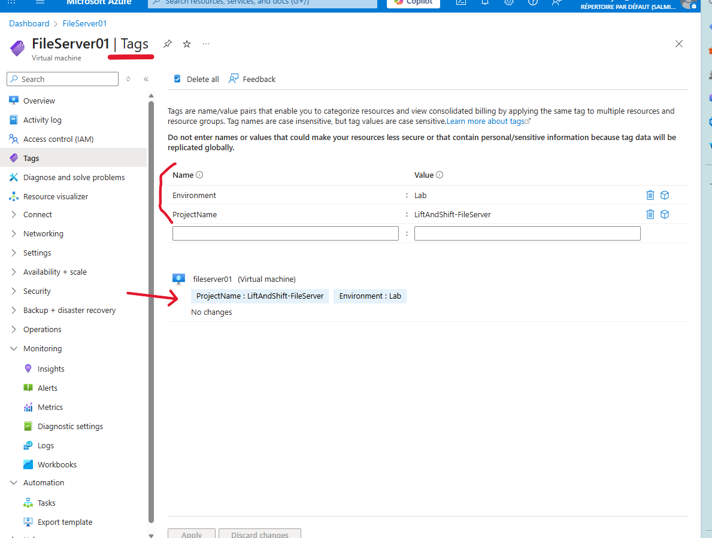
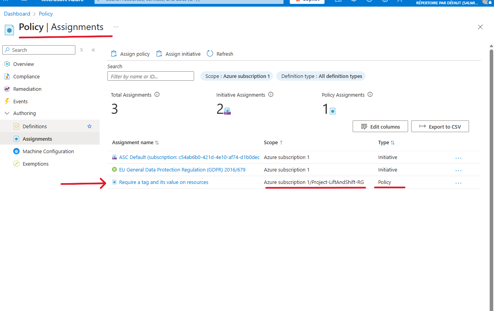

# Project 5: Azure "Lift and Shift" Migration & Governance

## Project Overview

This capstone project simulates the "lift and shift" migration of a critical on-premises file server to Microsoft Azure. The goal was not just to deploy a virtual machine, but to build a complete, secure, resilient, and well-governed cloud environment around it. This project demonstrates a full lifecycle of IaaS (Infrastructure-as-a-Service) management, from initial network design and security to ongoing operations like backup, monitoring, and cost governance.

## Technologies Used

*   Azure Virtual Machines (IaaS)
*   Azure Virtual Network (VNet) & Network Security Groups (NSGs)
*   Azure Managed Disks (Premium SSD)
*   Azure Backup (Recovery Services Vault)
*   Azure Monitor
*   Microsoft Defender for Cloud
*   Azure Policy
*   Azure Cost Management & Budgets

---
## 1. Secure Network Foundation

Before deploying any compute resources, I designed and deployed a secure network foundation.

*   **Network Segmentation:** I created a new Virtual Network (`Main-VNet`) with two distinct subnets (`Server-Subnet` and `WebApp-Subnet`). This logical separation ensures that different tiers of the application infrastructure are isolated from each other.

*   **Firewall Configuration:** I deployed a Network Security Group (NSG) to act as a stateful firewall. I configured a high-priority inbound rule to allow RDP access only from a specific, trusted IP address, while blocking all other management ports from the public internet. This NSG was then associated with the `Server-Subnet` to protect all resources within it.

---
## 2. Server Deployment and Configuration

With the network secured, I deployed the virtual machine.

*   **VM Deployment & Troubleshooting:** I initially deployed a `B1s` VM, which proved to be under-resourced for a Windows Server GUI workload, causing RDP sessions to crash. After diagnosing the issue using Azure Monitor Metrics (which showed 100% CPU spikes), I redeployed a properly sized `B2as_v2` VM, resolving the stability issues.

*   **Storage Best Practices:** Following best practices, I provisioned the server with two separate Premium SSDs: one for the Operating System and a second, dedicated **Data Disk**. This separates system files from user data, simplifying backups and management. The data disk was then initialized, formatted with NTFS, and configured with a file share inside the VM.

---
## 3. Resilience, Security, and Monitoring

A deployed server is only the beginning. The next phase focused on protecting and monitoring the workload.

*   **Automated Backup:** I created a Recovery Services Vault with a daily backup policy and 30-day retention. I successfully enabled backup for the `FileServer01` VM and ran the initial backup, ensuring the server is protected against data loss.

*   **Proactive Monitoring:** I configured an Alert Rule in Azure Monitor to proactively notify administrators via email if the VM's CPU usage exceeds 90% for a sustained period, allowing for intervention before users are impacted.

*   **Security Posture Management:** Using Microsoft Defender for Cloud, I assessed the security posture of the new VM. The recommendations identified several areas for security hardening, such as enabling a vulnerability assessment solution and protecting management ports with Just-in-Time (JIT) access.

---
## 4. Governance, Compliance, and Cost Management

The final phase was to apply high-level governance and cost management controls.

*   **Resource Tagging & Policy Enforcement:** I first demonstrated manual tagging by applying `ProjectName` and `Environment` tags directly to the VM. To ensure all future resources are properly tracked, I then implemented an **Azure Policy** that requires all new resources in the resource group to have a `CostCenter` tag. This demonstrates a scalable, automated approach to governance.

*   **Regulatory Compliance:** To meet a simulated business requirement, I added the **EU GDPR** standard to Microsoft Defender for Cloud. Using the Azure Policy compliance dashboard, I was able to generate a report showing the tenant's current compliance state against GDPR technical controls.

*   **Cost Management:** Finally, I created a **Budget** in Azure Cost Management for the project's resource group. I configured an alert to automatically send an email to administrators if spending is forecasted to exceed 80% of the monthly budget, ensuring financial accountability.

